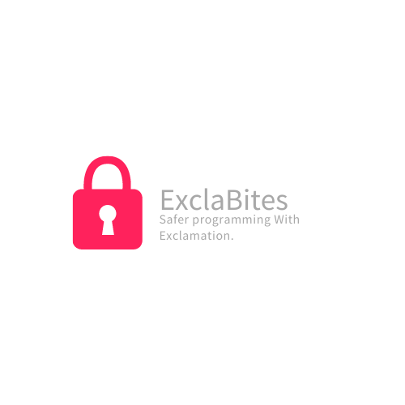

[]
# ExclaBites

ExclaBites Ensures you're writing Safe &amp; Fast code. Written In C++ &amp; Python, You can Make sure you are safe when writing a lot of code.

Exclabites Runs on the Exclamation Runtime Which you can download by Going to ExclamationTechnologies/excla_runtime.

